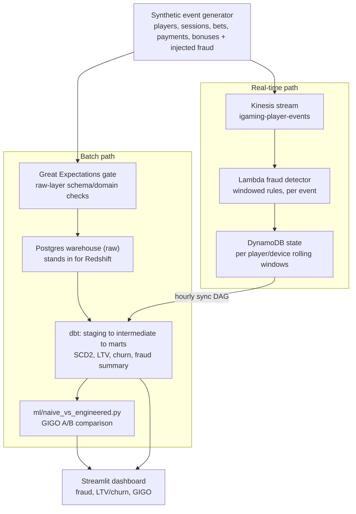

# iGaming Fraud & Analytics Platform

[Live interactive dashboard](https://ollie12321-igaming-fraud-analytics-plat-streamlit-appapp-rpmiko.streamlit.app/),
reading a versioned snapshot of this repo's synthetic data. Pick a fraud
scenario and drag the detection-interval slider to see real exposure
figures change, toggle data engineering fixes on/off and watch a distorted
metric heal in real time, or run a simulated GDPR erasure request against a
sample player.

An end-to-end data platform for an online gambling operator, built to answer one
question properly: which parts of a data platform actually need to be
real-time, and why does the rest of the business run better on batch?

Everything here is synthetic. No real player, payment, or gambling data is
used anywhere in this project (see [`docs/data_dictionary.md`](docs/data_dictionary.md)).
The synthetic generator injects labelled fraud/abuse scenarios with ground
truth that's never shown to the detector, so every metric quoted below
(precision, recall, latency, GIGO distortion) is *measured from a live run of
this repo*, not asserted.

## Why this exists

Most portfolio data projects pick one processing paradigm and one cloud stack
and stop there. This one is deliberately built the other way round, as a
demonstration of judgment rather than a single tool:

- Streaming vs. batch is a design decision, not a default. Fraud/AML
  detection (account takeover, card testing, bonus abuse, structuring,
  self-exclusion breaches, bot betting) runs on a real-time Kinesis-to-Lambda-to-
  DynamoDB pipeline, because money needs to be frozen before it leaves the
  platform. LTV, churn, and regulatory reporting run on a nightly dbt batch
  pipeline, because a player's lifetime value doesn't change meaningfully in
  the 23 hours between runs, and batch is dramatically cheaper and easier to
  reason about. The [Architecture](#architecture) section explains which
  workload went where and why.
- Data engineering is upstream of data science. The
  [Data Quality to Model Quality](#data-quality-to-model-quality-the-core-thesis)
  section trains the *same churn model* on the *same players* twice: once on
  a naive read of raw tables, once on the properly engineered dbt marts. The
  goal is to show, with real numbers, what bad data engineering actually
  costs a model that looks statistically fine on paper.
- iGaming domain knowledge, not generic e-commerce: bonus wagering
  requirements, self-exclusion/responsible-gambling obligations, AML
  structuring thresholds, and RTP-aware game economics all shape the schema
  and the fraud rules.
- Data governance isn't an afterthought. Every column is classified
  (public / internal / confidential / restricted), retention periods follow
  actual UK gambling/AML regulation, and there's a working right-to-erasure
  script that resolves the real conflict between "the player wants their data
  deleted" and "the regulator requires 5 years of AML records" (see
  [Data governance](#data-governance)).
- Versatility across a second stack. This project intentionally uses AWS
  (Kinesis, Lambda, DynamoDB, S3), dbt/Postgres, Airflow, Streamlit, and
  Terraform: a different cloud and toolchain to a GCP/BigQuery-based project,
  to show the underlying concepts transfer rather than being tied to one
  vendor's product names.

## Architecture



Orchestration (Airflow, `dags/`):

| DAG | Schedule | Does |
|---|---|---|
| `igaming_batch_pipeline` | daily | generate/extract raw, run the GE quality gate, load the warehouse, `dbt run`, `dbt test` |
| `sync_fraud_flags` | hourly | replays streaming detector output into the warehouse for BI (`fct_fraud_summary`) |
| `retrain_gigo_comparison` | weekly | re-runs the naive-vs-engineered churn comparison as marts drift |

### Why AWS for streaming, local Postgres for the warehouse

The streaming pieces (Kinesis, Lambda, DynamoDB, S3) are actually deployed
to AWS via Terraform. They're genuinely serverless/pay-per-use, so an idle
demo costs pennies. The warehouse and orchestrator are the opposite: Redshift
and MWAA are billed by the hour whether or not anything is running, which
doesn't make sense for a portfolio project nobody queries 24/7. Postgres (via
Docker Compose) stands in for Redshift, and a local Airflow (also Docker
Compose) stands in for MWAA. Same dbt SQL, same DAG code, same orchestration
patterns; only the always-on infrastructure underneath is swapped for
something free. This hybrid split is a real cost/architecture trade-off a
platform team would actually make, not a shortcut that changes what's being
demonstrated.

## Real-time fraud detection: measured performance

Every fraud scenario below is injected into the synthetic data with ground
truth, replayed through the exact same rule engine that runs in the deployed
Lambda (`streaming/local_backtest.py` uses an in-memory state store instead of
DynamoDB so this reproduces without needing an AWS account), then scored:

| Scenario | Entity | Ground truth | Caught | False positives | Recall | Avg. latency |
|---|---|---:|---:|---:|---:|---:|
| Account takeover | login | 45 | 44 | 12 | 97.8% | 478.1s* |
| Account takeover | payment | 45 | 44 | 12 | 97.8% | 0.8s |
| Bonus abuse ring | bonus_claim | 100 | 75 | 0 | 75.0% | 0.9s |
| Bot betting | session | 35 | 30 | 0 | 85.7% | 0.8s |
| Card testing | payment | 348 | 226 | 0 | 64.9% | 0.9s |
| Self-exclusion breach | login | 43 | 43 | 1 | 100.0% | 0.8s |
| Structuring | payment | 73 | 46 | 0 | 63.0% | 0.8s |

\* ATO is only confirmed once the *second* signal (a withdrawal on the new
device/geo) arrives, so the 478s figure is genuine detection latency for that
rule, not a processing delay. The payment-side flag on the same incident
lands in under 1s.

Numbers regenerate every time the pipeline runs (see
[Running it yourself](#running-it-yourself)). They are deliberately imperfect:
a detector that reports 100% recall on synthetic data with 0% false positives
on every rule usually means the injected scenarios were too easy, not that
the rules are good.

The dashboard's Batch vs. Streaming tab turns this into a calculator: pick a
scenario, drag a detection-interval slider from real-time down to a daily
batch check, and it computes the expected additional fraud exposure in GBP
from this project's own measured event rate and average transaction value,
not a made-up number.

## Data Quality to Model Quality (the core thesis)

`ml/naive_vs_engineered.py` trains the same `LogisticRegression` churn model,
on the same underlying players, twice:

- naive: queried straight from `raw.*`, the way an analyst who skips the
  modelled warehouse layer would. No dedup of at-least-once ingestion
  retries, five currencies summed as if they were all GBP, bot-inflated
  sessions counted at face value, self-excluded players silently folded into
  "churned".
- engineered: read from the dbt marts (`dim_players_scd2`,
  `fct_player_ltv`, `fct_churn_labels`). Deduplicated, GBP-normalised, bot
  sessions excluded, self-excluded players held out because they didn't
  churn for a reason any win-back campaign could act on.

A representative run:

| Metric | Naive | Engineered |
|---|---:|---:|
| AUC | 0.847 | 0.845 |
| Average precision | 0.351 | 0.259 |
| Precision | 0.074 | 0.056 |
| Recall | 0.811 | 0.837 |

AUC barely moves. That's the point. The model looks statistically fine
either way. The failure isn't in its ability to discriminate, it's in what
the label and the features actually mean:

- Total deposit book is distorted by ~75% in the naive read: ~2 points
  from unremoved ingestion duplicates, ~73 points from summing five
  currencies as if they were all GBP.
- Every self-excluded player (a legal/responsible-gambling status, not
  organic disengagement) is mislabelled as ordinary churn in the naive
  dataset, so a model trained on that label would recommend a win-back
  marketing campaign to every one of them.

This is the argument in concrete, reproducible form: a downstream model can
clear every statistical bar you check and still be built on a lie, if the
data engineering underneath it was wrong.

## Slowly Changing Dimensions

`dim_players_scd2` (`dbt/models/marts/dim_players_scd2.sql`) is a hand-rolled
Type 2 SCD over `player_attribute_history` (VIP tier, KYC status,
self-exclusion status, risk segment). Every change gets its own row with
`valid_from` / `valid_to` / `is_current`, so any historical date can be
queried point-in-time-correctly (e.g. "what was this player's risk segment on
the day of the incident?", not just "what is it now"). A custom dbt test
(`dbt/tests/assert_scd2_no_overlapping_periods.sql`) asserts no player ever
has two overlapping "current" periods.

## Data governance

Governance is treated as a first-class, working part of the platform rather
than a policy document nobody implements. Full detail in
[`docs/data_governance.md`](docs/data_governance.md); summary:

- Classification: every raw and modelled column is tagged
  `public` / `internal` / `confidential` / `restricted` directly in dbt
  metadata (`meta.classification`, `meta.pii` in `dbt/models/**/schema.yml`),
  so lineage and sensitivity travel together instead of living in a separate
  spreadsheet.
- Retention: retention periods are set per data category against actual
  regulatory bases (UK Gambling Commission LCCP, Money Laundering Regulations
  2017 5-year AML record-keeping, UK GDPR/DPA 2018), not an arbitrary "keep
  everything forever."
- Right to erasure vs. AML retention: `governance/erasure.py` is a
  working script that resolves the actual conflict operators face: a player
  requests deletion, but AML law requires their transaction history be kept.
  It pseudonymises direct identifiers (device fingerprints, IP addresses) in
  place while preserving the financial/behavioural aggregates a regulator can
  still demand, and writes an audit record of what was done and why.
- Lineage: `dbt docs generate` produces a browsable column-level lineage
  graph from `raw.*` through staging/intermediate to the marts, so "where did
  this number come from" and "what does this PII field feed into" are always
  answerable.

The dashboard's Data Governance tab renders the classification/PII/retention
metadata straight from the dbt `schema.yml` files (not a separate copy of
it), and includes a working simulator: pick a sample player, submit a
right-to-erasure request, and it runs the real salted hash function live
against a real "before" value, then shows exactly what gets pseudonymised
versus retained and why. No data is written anywhere; it's read-only against
a bundled snapshot.

## Tech stack

| Layer | Tool | Notes |
|---|---|---|
| Streaming ingestion | AWS Kinesis Data Streams | single shard, sized to this project's volume rather than over-provisioned |
| Streaming compute | AWS Lambda | windowed fraud rules, per-event, `streaming/fraud_rules/` |
| Streaming state | AWS DynamoDB | per-player/device rolling windows with TTL |
| Streaming reference | Apache Flink (PyFlink) | `streaming/flink_reference/`, not deployed; shows the higher-throughput alternative and why it wasn't chosen here |
| Batch warehouse | Postgres (stands in for Redshift) | `docker-compose.yml` |
| Transformation | dbt | staging to intermediate to marts, SCD2, tests |
| Orchestration | Apache Airflow | `dags/`, local via Docker Compose (stands in for MWAA) |
| Data quality | Great Expectations | raw-layer schema/domain gate, `quality/` |
| Data governance | dbt meta tags + custom scripts | classification, retention, erasure, `governance/` |
| ML | scikit-learn | naive-vs-engineered churn comparison |
| BI | Streamlit + Plotly | `streamlit_app/` |
| IaC | Terraform | `terraform/`, hybrid deploy (see above) |
| CI | GitHub Actions | lint + full pipeline smoke test + terraform validate, `.github/workflows/ci.yml` |

## Repository layout

```
config/               Environment-backed settings shared by every component
datagen/              Synthetic population + labelled fraud scenario generator
quality/              Great Expectations raw-layer data quality gate
governance/           Data classification, retention, and right-to-erasure tooling
load/                 Parquet-to-Postgres raw-schema loader
dbt/                  staging to intermediate to marts, SCD2, dbt tests
streaming/
  fraud_rules/          The actual detection logic (shared by Lambda + backtest)
  lambda_fraud_detector/ Lambda handler (deployed)
  kinesis_producer/      Replays historical events onto the real Kinesis stream
  flink_reference/       Reference-only alternative implementation
  local_backtest.py      Replays events through the same rules with in-memory state (no AWS needed)
ml/                   Naive-vs-engineered churn model comparison (the GIGO demo)
streamlit_app/        Dashboard: overview, batch vs streaming, fraud, LTV/churn, GIGO, governance
dags/                 Airflow DAGs (batch pipeline, flag sync, GIGO retrain)
terraform/            AWS IaC for the streaming stack
docs/                 Data dictionary, data governance policy
```

## Running it yourself

Requires Docker, Python 3.11+, and (optionally) an AWS account for the
streaming stack. Everything else runs entirely locally and free.

```bash
# 1. Set up
python -m venv .venv && source .venv/bin/activate
pip install -r requirements.txt
cp .env.example .env                    # defaults work as-is for local dev
cp dbt/profiles.yml.example dbt/profiles.yml

# 2. Local warehouse + orchestrator
docker compose up -d warehouse airflow-postgres airflow-init airflow-webserver airflow-scheduler

# 3. Generate synthetic data + run the raw-layer quality gate
export $(grep -v '^#' .env | xargs)
python -m datagen.simulate --output-dir data/raw
python -m quality.raw_data_checks --raw-dir data/raw

# 4. Run the streaming fraud detector against the historical data (no AWS needed)
python -m streaming.local_backtest --input-dir data/raw --output-dir data/processed

# 5. Load raw + streaming output into the warehouse, then run dbt
python -m load.postgres_loader --input-dir data/raw --processed-dir data/processed
cd dbt && dbt deps && dbt seed && dbt run && dbt test && cd ..

# 6. Run the GIGO comparison
python -m ml.naive_vs_engineered

# 7. Explore
streamlit run streamlit_app/app.py
```

Airflow UI: http://localhost:8080 (admin/admin). `igaming_batch_pipeline`
runs steps 3 to 5 end to end on a schedule.

### Regenerating the public dashboard snapshot

The hosted dashboard has no access to the local Docker warehouse, so it reads
a versioned snapshot from `streamlit_app/snapshot_data/` instead of querying
Postgres live (`USE_SNAPSHOT_DATA=true`). Regenerate it after changing the
data or models:

```bash
python -m streamlit_app.export_snapshot
```

### Deploying the real-time stack to AWS (optional)

```bash
cd terraform
cp terraform.tfvars.example terraform.tfvars   # edit as needed
terraform init
terraform apply
```

This provisions the Kinesis stream, the Lambda fraud detector, its DynamoDB
state tables, and an S3 raw-event archive, all pay-per-use. Nothing in
`terraform/` provisions an always-on resource.

```bash
python -m streaming.kinesis_producer.producer --input-dir data/raw   # replay events onto the real stream
```

## CI

`.github/workflows/ci.yml` runs on every push/PR:

1. lint: ruff + black
2. pipeline: generates a small synthetic dataset, runs the Great
   Expectations gate, replays the streaming backtest, loads Postgres, runs
   the full dbt build + tests, exercises the right-to-erasure script, and
   runs the GIGO comparison. The entire pipeline, for real, on every commit.
3. terraform: `fmt`, `init -backend=false`, `validate`

## Data dictionary

See [`docs/data_dictionary.md`](docs/data_dictionary.md) for the full schema
and the fraud scenario to detection-rule mapping.
